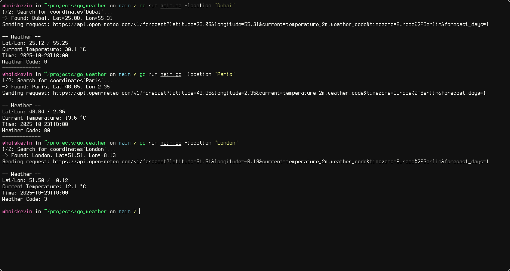

# Goweather

Simple cli application to get the current temperature.
This works by fetching data from the [OpenMeteoAPI](https://open-meteo.com/).

## Usage

You can simply run `go run main.go` and the programm gets 
executed with "Berlin" as the default location.

There is the `-location` flag.
Run `go run main.go -location "<YOUR_LOCATION>"` and the [GeocodingAPI](https://open-meteo.com/en/docs/geocoding-api)
will determine the coordinates for you and simply give you the temperature.
